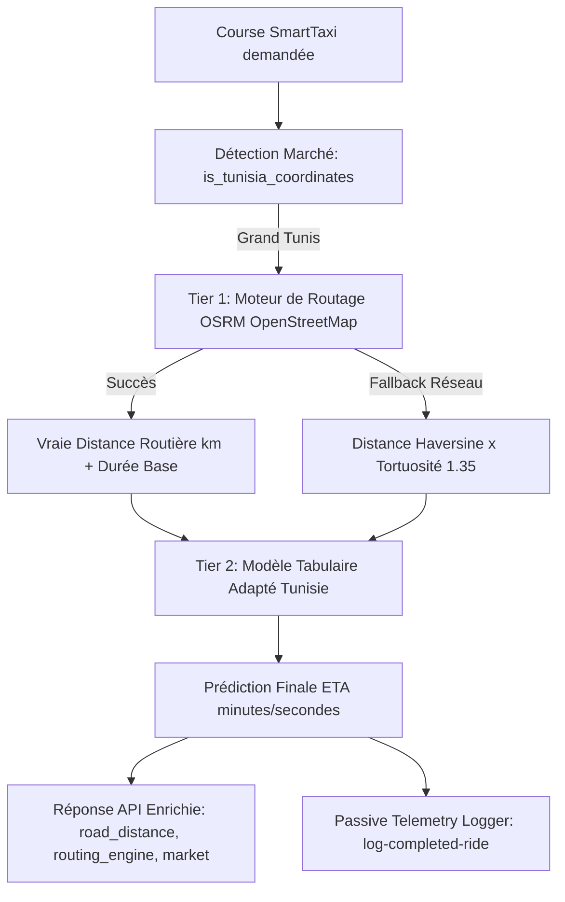

# Stratégie d'Adaptation au Marché Tunisien (Grand Tunis)

**Plateforme Smart Arrival Time Estimation (ETA) — SmartTaxi / TSE Consultant INT**

---

## 1. Contexte & Problématique : Cold-Start et Domain Shift

Dans le cadre du développement de la plateforme de prédiction d'ETA pour le marché tunisien, une contrainte majeure de l'écosystème de transport local réside dans **l'absence de données télémétriques publiques massives et horodatées** (traces GPS, durées effectives par segment routier), contrairement aux métropoles comme New York qui publient des dizaines de millions de courses via la *NYC Taxi and Limousine Commission (TLC)*.

Pour concevoir une solution robuste et prête pour la production, l'équipe a adopté une démarche en deux volets :
1. **Validation MLOps de référence (Surrogate Prototype) :** Utiliser le dataset NYC TLC pour valider rigoureusement l'architecture logicielle (ingestion, feature store, découpage temporel strict sans fuite, benchmarks RF/XGBoost/LightGBM/CatBoost, API FastAPI asynchrone, Docker et tests d'intégration).
2. **Adaptation au Domaine Tunisien (Cold-Start & Domain Shift) :** Adapter le moteur d'inférence, la topologie routière et les modèles prédictifs aux caractéristiques réelles de Grand Tunis.

---

## 2. Diagnostic Comparatif : New York (NYC) vs Grand Tunis

| Dimension | New York (NYC - Manhattan) | Grand Tunis (Tunisie) | Impact & Solution Technique |
| :--- | :--- | :--- | :--- |
| **Topologie urbaine** | Plan en damier régulier (grille à 90°). La distance de Manhattan ($L_1$) y est quasiment exacte. | Réseau organique, médinas, ronds-points, échangeurs, voies rapides (RN9, Voie X, X20, Z4). | **Facteur de tortuosité $\times 1.35$** et intégration d'un moteur de routage **OSRM (OpenStreetMap)**. |
| **Profils de vitesse** | Vitesse très faible et homogène (12–18 km/h) due aux feux synchronisés à chaque bloc. | Forte hétérogénéité : 12–18 km/h en centre-ville (Lafayette/Bourguiba), 65–80 km/h sur voies express. | **Vitesses de repli segmentées** par zone urbaine et voies express. |
| **Rythmes & Heures de pointe** | 08:00–10:00 (matin) et 17:00–19:00 (soir) classiques. | Matin (07:30–09:00), **midi scolaire/bureau (12:30–14:00)**, soir (17:00–19:00). Régime spécifique d'été (*séance unique*) et Ramadan. | Algorithme `is_tunisian_rush_hour` avec prise en compte de la pointe méridienne. |
| **Identifiants de zones** | Zones TLC fixes (`PULocationID` 1 à 265). | Coordonnées GPS continues (WGS84). | Modélisation **100% Coordinate-Agnostic** (distances relatives et dynamiques spatiales). |

---

## 3. Architecture Technique Hybride : Routage Réseau + Correcteur ML

Pour garantir une estimation d'arrivée précise dès le premier jour de mise en service sans données historiques préalables, le microservice déploie une **architecture en deux couches (Two-Tier ETA Engine)** :



### Couche 1 : Routage Réseau OSRM (`src/features/routing.py`)
- Interroge le moteur OpenStreetMap OSRM pour calculer la trajectoire réelle sur le réseau routier tunisien.
- Dispose d'un cache mémoire LRU (`@functools.lru_cache`) pour conserver une latence d'inférence $< 15\text{ ms}$.
- Si la connectivité externe est indisponible ou dépasse 1.2s, bascule instantanément sur la **tortuosité calibrée de Grand Tunis ($1.35 \times \text{haversine}$)**.

### Couche 2 : Modèle ML Adapté (`models/tunisia_champion_model.joblib`)
- Ajuste la durée théorique en fonction des conditions de circulation (heure de pointe tunisienne, jour de semaine, météo, densité de trafic).
- Le modèle champion retenu (**LightGBM adapté**) atteint un $R^2 = 0.831$ sur la distribution de test tunisienne.

---

## 4. Système de Collecte Télémétrique Passive (Shadow Logging)

Pour résoudre définitivement le démarrage à froid au fur et à mesure de l'exploitation de SmartTaxi, un module de journalisation passive est intégré à l'API :

* **Endpoint de collecte :** `POST /telemetry/log-completed-ride`
* **Stockage persistant :** `data/interim/tunisia_telemetry_log.csv`
* **Données capturées :** Coordonnées de départ/arrivée, horodatage, durée réelle constatée à la fin de la course, ETA prédit, distance routière réelle et conditions météo/trafic.
* **Supervision du seuil de ré-entraînement :** `GET /telemetry/stats` expose l'indicateur d'éligibilité au fine-tuning (seuil fixé à 500 courses réelles enregistrées).

---

## 5. Dataset Bootstrap de Grand Tunis (`scripts/generate_tunisia_bootstrap_data.py`)

Un jeu de données synthétique réaliste de **3 000 courses** a été généré sur les pôles d'attractivité majeurs de Grand Tunis :
* Aéroport International Tunis-Carthage (TUN)
* Les Berges du Lac 1 et Lac 2
* Centre-Ville (Avenue Habib Bourguiba / Place Barcelone)
* La Marsa (Corniche / Saf-Saf)
* Sidi Bou Saïd & Carthage Byrsa
* Ennasr 2 (Avenue Hédi Nouira) & El Menzah 9
* Technopôle El Ghazela / ESPRIT
* Le Bardo (Musée National) & La Goulette

### Résultats du Benchmark Comparatif sur Grand Tunis :

| Modèle | MAE (minutes) | MAE (secondes) | RMSE (minutes) | $R^2$ Score | Statut |
| :--- | :--- | :--- | :--- | :--- | :--- |
| **Baseline (Vitesse moyenne Grand Tunis)** | 10.18 min | 610.7 s | 15.60 min | 0.443 | Réf. Heuristique |
| **Random Forest (Tunisie)** | 6.41 min | 384.9 s | 8.75 min | 0.825 | Candidat |
| **LightGBM (Tunisie - Champion)** | **6.34 min** | **380.4 s** | **8.60 min** | **0.831** | **Champion Déployé** |

---

## 6. Protocole de Transition vers la Production Flotte

```
[Phase 1 : Immédiat]
Prototype Surrogate NYC + Couche Routage OSRM Grand Tunis + Modèle Adapté Bootstrap
        │
        ▼
[Phase 2 : Phase Pilote (J+1 à J+30)]
Shadow Logging via /telemetry/log-completed-ride sur les premières courses de la flotte
        │
        ▼
[Phase 3 : Retraining Automatisé (Dès 500 courses réelles)]
Exécution de scripts/train_tunisia_adapter.py sur les données réelles SmartTaxi
        │
        ▼
[Phase 4 : Modèle Dédié Flotte SmartTaxi en Production]
```

Ce protocole garantit une traçabilité scientifique rigoureuse, une continuité de service ininterrompue et une adaptation optimale aux spécificités du terrain tunisien.
